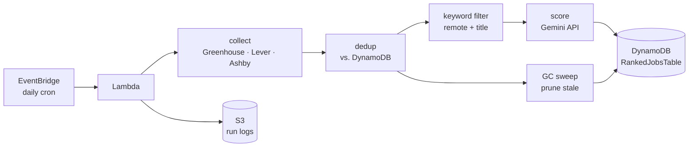

# JobFinder

A serverless job scraper and AI fit-scorer that runs itself. Every day it pulls postings from public ATS feeds using a list of source companies that use those ATSs, narrows them to remote roles matching a keyword profile created by the user, scores each one against a personal rubric using the Gemini API, and writes the ranked results to DynamoDB — all on a single scheduled AWS Lambda invocation that costs effectively nothing to operate.

It's two things at once: a functional tool that surfaces relevant jobs without manual searching, and a portfolio project demonstrating Go, AWS, and LLM integration end to end.

---

## What it does



The pipeline is **collect → dedup → filter → score → write**, with a
garbage-collection pass folded into the same run:

1. **Collect** — Fetch every posting from a configured list of companies across
   three ATS providers (Greenhouse, Lever, Ashby), each behind its own public
   JSON API, and normalize them into a single `Job` shape.
2. **Dedup** — Scan the existing table and keep only postings that haven't been
   scored before, so the expensive scoring step never repeats work.
3. **Garbage-collect** — Refresh a `last_seen` timestamp on every job still live
   in today's feed, and delete jobs that haven't appeared in two days (assumed
   filled or pulled). A two-day buffer means a single broken scrape run can't
   wrongly delete anything.
4. **Filter** — Reduce to remote roles whose titles match an include/exclude
   keyword profile.
5. **Score** — Send the survivors to Gemini in small batches with a structured
   output schema, scoring each against a rubric (`instructions.md`) and getting
   back a key, a score, and a reasoning string.
6. **Write** — Persist ranked results to DynamoDB and flush the run's logs to S3.

---

## Architecture

| Component | Role |
|---|---|
| **AWS Lambda** (`provided.al2023`, arm64) | Runs the whole pipeline on one invocation |
| **Amazon EventBridge** | Triggers the function daily via cron |
| **Amazon DynamoDB** (`PAY_PER_REQUEST`) | Stores ranked jobs; doubles as the dedup/GC ledger |
| **Amazon S3** | Holds config files (`sources.json`, `filterKeywords.json`, `instructions.md`) and run logs |
| **AWS SSM Parameter Store** | Stores the Gemini API key as an encrypted SecureString |
| **Google Gemini API** (`gemini-3.1-flash-lite`) | Scores each job against the rubric; Chosen for generous free usage tier and benchmark scores |
| **AWS SAM** | Defines and deploys all of the above as one stack |

The Go package is intentionally **flat** — no `cmd/` or `internal/` scaffolding.

---

## Engineering decisions

The interesting parts of this project are less about the scraping and more about making a rate-limited, stateful pipeline behave correctly and cheaply on serverless infrastructure.

### Idempotent dedup and garbage collection

DynamoDB serves double duty as both the result store and the "have I seen this?" ledger. Each job's identity is a **composite key** — a stable key (company + title + location) joined with its posting timestamp. A shared `compositeKey()` helper guarantees that a freshly scraped `Job` and a stored `DynamoDBItem` produce byte-for-byte identical keys, so membership checks never drift between the two representations.

Garbage collection rides on the dedup scan that already happened. Jobs still present in the live feed get their `last_seen` bumped; jobs absent for more than two days get deleted — unless they're flagged as applied-to. Because deletions are driven by feed membership rather than a stored timestamp alone, a scrape that fails for a day simply skips a bump rather than triggering false deletions. The whole sweep is idempotent: re-running it produces the same end state.

### Rate limiting against a free-tier ceiling

Gemini's free tier caps requests per minute, requests per day, and **tokens** per minute. The scoring loop respects all three with two independent guards: a ticker that paces requests under the RPM limit, and a sliding-window token throttle that sums recent usage and blocks until there's budget before each batch.

The subtle bug this surfaced: persistent `429`s that no per-invocation throttle could explain. The root cause was **concurrent Lambda executions** — Lambda's default retry behavior was spawning overlapping invocations, each maintaining its own in-memory token counter, collectively blowing past the shared API ceiling. The fix was a one-line change in the SAM template (`MaximumRetryAttempts: 0`) plus using asynchronous invocation for manual tests. The throttle is correct; 429's almost certainly mean that there are concurrent executions. With retries disabled, this bug now only surfaces during manual "aws lambda invoke" tests.

### Live token-estimate calibration

Before each batch the code estimates token cost from description length, reserves that against the throttle budget, then logs the estimate against Gemini's actual reported usage. This produced a useful empirical finding: the real character-to-token ratio for these payloads is ~1.6–1.9, not the commonly assumed 4.0 — so estimates calibrated on the wrong ratio would have been off by more than 2x. The calibration log line makes the estimator tunable over time.

### Reliable structured output

Rather than parsing free-form text, scoring requests pin a JSON `responseSchema` (an array of `{key, score, reasoning}` objects). Gemini returns conforming JSON, which unmarshals directly and is joined back to the source jobs by key. Jobs that come back without a score or with a malformed key are logged and skipped rather than silently dropped.

### Failure isolation

Failures are scoped so one bad input can't sink a run. A company whose ATS slug 404s logs a warning and is skipped. A failed table scan degrades to a full re-grade day rather than aborting or, worse, driving deletions off incomplete data. Transient `5xx`s from Gemini are retried with exponential backoff and jitter; `4xx`s fail fast instead of burning retries.

### Least-privilege IAM

Permissions are split into separate scoped policy documents per concern — table CRUD, log-bucket writes, config-bucket reads, and a single SSM parameter read — rather than one broad policy. The Gemini key never appears in code or environment plaintext. It must be set and pulled from an encrypted SSM SecureString at startup.

---

## Project structure

```
.
├── main.go                  # entrypoint + handler orchestration
├── helpers.go               # Job type, collect(), generic fetchJSON, S3/SSM helpers
├── greenhouse.go            # Greenhouse ATS fetcher + normalization
├── lever.go                 # Lever ATS fetcher + normalization
├── ashby.go                 # Ashby ATS fetcher + normalization
├── filter.go                # include/exclude keyword filtering
├── gemini.go                # Gemini request/response, scoring, rank join
├── aiErrors&Throttling.go   # TPM sliding-window throttle, retry/backoff
├── database.go              # DynamoDB read/write, dedup keys, GC sweep
├── logging.go               # slog JSON logging buffered to S3
├── template.yaml            # AWS SAM infrastructure definition
└── samconfig.toml           # SAM deploy configuration
```

---

## Configuration

Three files live in the S3 config bucket and drive behavior without code changes:

- **`sources.json`** — a map of provider → list of company slugs to scrape, e.g. `{ "greenhouse": ["stripe", ...], "lever": [...], "ashby": [...] }`.
- **`filterKeywords.json`** — `{ "include": [...], "exclude": [...] }` applied to job titles. A single occurrence of an 'exclude' keyword in the title filters out job and the title must include, at least, one word from the 'include' list unless 'include' list is empty.
- **`instructions.md`** — the scoring rubric handed to Gemini as system instructions plus the candidate's background: CV, skills, experience, etc. Encodes the hard-fail gates and scoring bands.

Several values in code are tunable as API limits or models change — batch size (smaller = more precise scoring, larger = fewer requests), the request ticker interval, the token-per-minute budget, and the Gemini model ID. These are the levers to adjust if you swap models or hit different rate limits.

---

## Deployment

Built and deployed with the AWS SAM CLI:

**User must update "GEMINIAPIKEY" address in template.yaml once SSM parameter has been saved in AWS**
**To avoid additional adjustments to template.yaml file:**
- User must have an S3 bucket named "jobfinder-config-files" with instructions.md, sources.json, and filterKeywords.json files uploaded
- User must have an S3 bucket named "jobfinder-log-bucket"
**Note:** the SAM currently has the program running everyday at 13:00UTC. You will need to adjust the line that says "cron(0 13 * * ? *)" if you want it to run at a different time. 

```bash
sam build
sam deploy
```

Deploy settings (stack name, region, S3 prefix) are in `samconfig.toml`. The function targets `provided.al2023` on arm64 with a 900-second timeout — generous headroom for the paced scoring loop, which is deliberately slow to stay under rate limits and to improve grading efficiency.

> **Note:** because the DynamoDB table is a named, stateful resource with a fixed key schema, changing its keys requires tearing down and recreating the stack — in-place updates won't apply a new key schema.

---

## Cost

Operates within the AWS and Gemini free tiers. One Lambda invocation per day, on-demand DynamoDB at trivial volume, a handful of small S3 objects, and free-tier Gemini scoring — effectively $0/month to run for duration of AWS free-tier service. After AWS free-tier expiration, it should still cost under $1 a month to run as long as log file bucket is purged regularly. 

---

## Roadmap

- Export + remote apply-marking workflow (mark jobs applied-to, protected from GC)
- GitHub OIDC for keyless CI deploys
- Read-time filtering at the export layer
- Setup CloudWatch to alert a major faults
- Implementation of additional ATS providers and job boards that have RSS feeds
- Improved keying to Gemini to prevent the rare scoring malfunctions
- Optional salary-band scoring (compensation is already captured at ingest but intentionally not yet sent to the scorer)